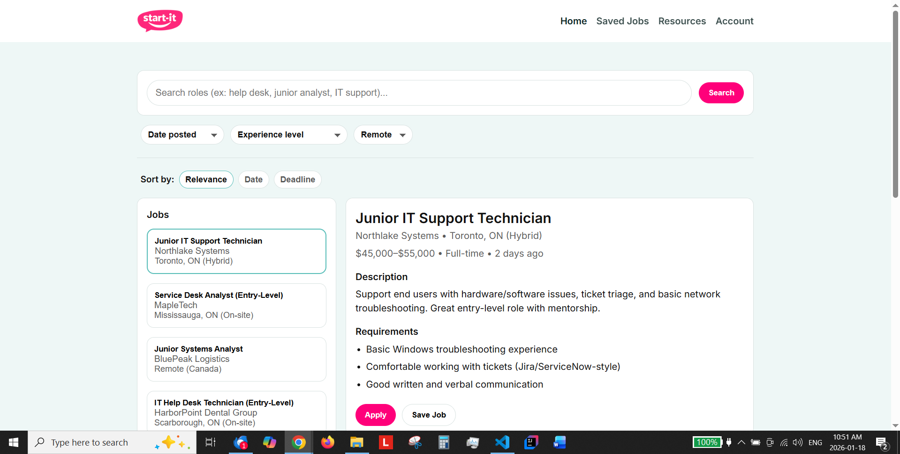

# start-it
A job board web app that helps users browse and explore entry-level opportunities.

## Features
- Browse and filter job postings (placeholder data, for now)
- View job details
- Responsive layout (desktop + mobile)

## Tech Stack
- React
- Vite
- JavaScript / CSS
- GitHub

## MVP 1
✅ Job board layout
⬜ Filters
⬜ Save jobs
✅ Resource page layout
⬜ Qualified resource links
✅ Account page layout
⬜ User creation and authentication
⬜ Web scraper implementation
⬜ AI for qualifying job listings

Work-in-progress; more to come!

## Screenshots

